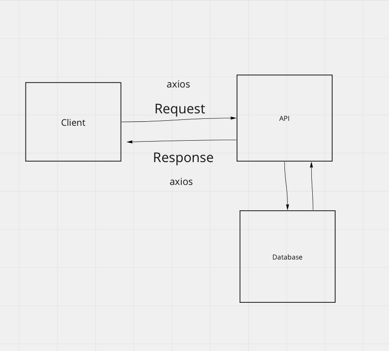

# Project Name

**Author**: Danny Castro
**Version**: 1.0.0 (increment the patch/fix version number if you make more commits past your first submission)

## Overview
This project will allow the user to type in the city and a map will render of the city chosen.  We will be able to do this with API's.

## Getting Started
<!-- What are the steps that a user must take in order to build this app on their own machine and get it running? -->
To begin to create each compnent needed.

## Architecture
<!-- Provide a detailed description of the application design. What technologies (languages, libraries, etc) you're using, and any other relevant design information. -->

## Change Log
<!-- Use this area to document the iterative changes made to your application as each feature is successfully implemented. Use time stamps. Here's an example:

01-01-2001 4:59pm - Application now has a fully-functional express server, with a GET route for the location resource. -->

## Credit and Collaborations
<!-- Give credit (and a link) to other people or resources that helped you build this application. -->.

Name of feature:City-explorer

Estimate of time needed to complete: 3 hours

Start time: 8:15pm 3.16.22

Finish time: 5:30pm 3.17.22

Actual time needed to complete: incomplete

